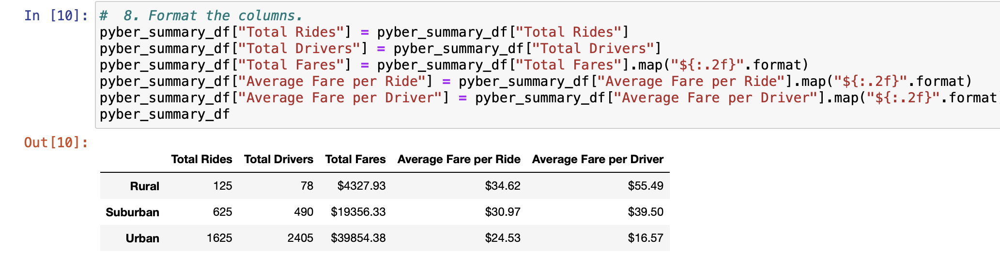
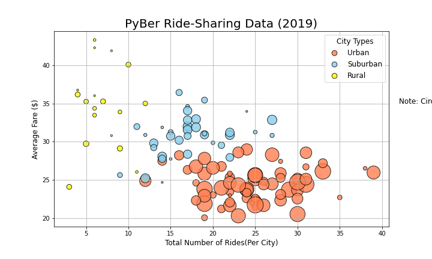
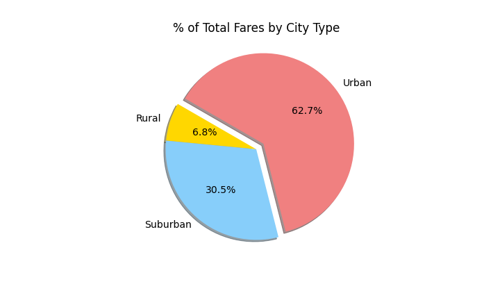
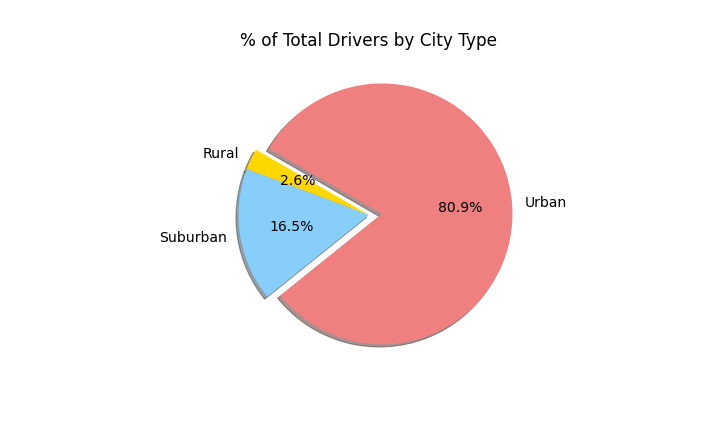
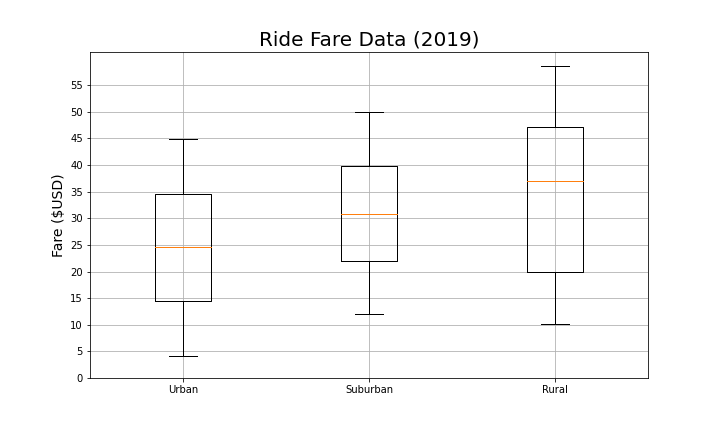
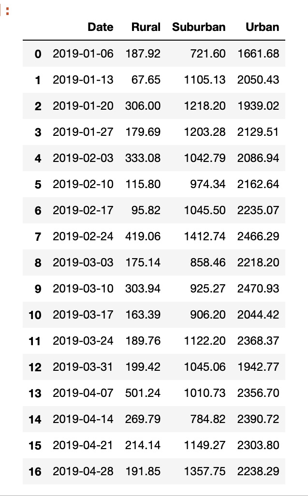
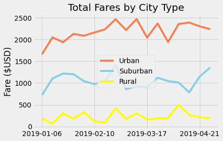

# Overview of the Analysis
The purpose of the analysis is to create a summary DataFrame of the ride-sharing data by city-type. A multi-line graph was also created to show the total weekly fares for each city type. We were also given the task of making a short summary of how the data differs by city type and how these differences can be used by the ride-sharing company.

# Results
## Ride Sharing Data
The data frame that we were able to create (using the code that is also shown) shows us a summary of total rides, total drivers, total Fares, average fares per ride and per driver. The summary is also accompanied by a scatter plot that will show us the driver count, the average fare and the total rides per city .The other reults will be expleined further below.  

DataFrame Summary of Ride Sharing Data

Scatter Plot showing Driver Count, Average Fare and Total Rides per City Type

### Total Rides, Total Drivers and Total Fares by City Type
Urban cities have the highest numbers in terms of total rides, total drivers and total fares by city type as seen in the Data Frame above and as shown in the three different pie charts below. In fact, in all three charts urban cities have numbers above 60% in all three categories, and in each category is greater than the numbers of the two other city types combined. 

Pie Chart Showing % of Total Fares by City Type 

Pie Chart Showing % of Total Rides by City Type

Pie Chart Showing % of Total Drivers by City Type

### Average Fare per Ride and Average Fare per Driver
Although the urban cities have the highest numbers, in terms of total ride and driver count as well as total fares by city type, the same is not true for the average Fare per Ride and Average Fare per Driver. The rural cities have higher values in these categories.

Using the measures of central tenndency we were able to determine that despite having the least amount of ride count, driver count and total fares, rural cities have the highest average fare per ride at $34.62 and median fare price at $37.05. 

The box and whiskers plot shown below also shows us that the average fare for rides is  about $11 and $5 more per ride than the urban and suburban cities.

Box and Whiskers Plot showing Ride Fare Data

Rural cities also had a much higher average fare per driver compared to the two other city types. The Average Fare per Driver is $55.49 in rural cities compared to $39.50 for suburban cities and $16.57 for urban cities. 

## Total Weekly Fares for Each City Type 
For a span of seventeen weeks we were able to collect and analyze the total weekly fares of the different city types. The urban cities consistently had the highest fares for each of the seventen weeks from which the data was collected. The order (in terms of greatest to least) did not change throughout the seventeen weeks with the order of the city types being Urban, Suburban and Rural.

The DataFrame shown below is made up from the data gathered from the 17 weeks. It is also the basis of the multi-tine graph shown afterwards.

When I was taking a look at the graph, I noticed that there was not much, in terms of similarities of whether the fares will increase or decrease in all city types, however for the week between 02/17 to 02/24 there was a significant increase in fares in ALL, city types and a decrease in fares in all city types the week after. Although the decrease was much more significant in rural and suburban cities than in the urban cities.

# Summary
One of the things that was not mentioned in this analysis was the actual distance travelled per ride and the actual cost per ride, if distance was the primary factor. I am thinking that this is actually the reason why there is a higher average per ride and driver in rural cities despite having lesser ride counts. It would be interesting to look at the ride counts for a set range of distances for each city type. 

Another factor that might be considered or included in the analysis is the actual time spent travelling per ride or distance vs travel time during specific days of the week or time of day and how it might affect revenue/costs for the driver and even the passenger in terms of possible higher fare if they need to take an unexpected detour or a different route. Eg. There might be heavier traffic in urban cities during rush hour traffic on a monday morning or friday afternoon than in rural or suburban cities.

